# ☁️ Serverless Web Application on AWS


> A fully serverless web application deployed on AWS using free-tier eligible services. Features a static website hosted on S3 + CloudFront with a live visitor counter powered by Lambda and DynamoDB — all served over HTTPS on a custom domain.

---

## 📌 Table of Contents

- [Project Overview](#-project-overview)
- [Architecture](#-architecture)
- [AWS Services Used](#-aws-services-used)
- [Project Structure](#-project-structure)
- [Step-by-Step Implementation](#-step-by-step-implementation)
- [Lambda Function Code](#-lambda-function-code)
- [Challenges & Solutions](#-challenges--solutions)
- [Cost Breakdown](#-cost-breakdown)
- [Resource Cleanup](#-resource-cleanup)
- [Key Learnings](#-key-learnings)

---

## 📖 Project Overview

This project demonstrates how to build and deploy a **fully serverless web application** on AWS without managing any servers. The application includes:

- 🌐 A **static website** served globally via CloudFront CDN
- 🔒 **HTTPS** secured with a free SSL certificate from AWS ACM
- 🌍 A **custom domain** (`shra.qzz.io`) registered for free via DigitalPlat
- 📊 A **live visitor counter** that increments on every visit using Lambda + DynamoDB
- 🆓 Built entirely on **AWS Free Tier** (cost: ~$0.50 for Route 53 only)

---

## 🏗️ Architecture

```
User / Browser
      │
      │ HTTPS
      ▼
Amazon CloudFront (CDN + HTTPS termination)
      │                         │
      │ Static Files            │ JS fetch()
      ▼                         ▼
Amazon S3                  AWS Lambda
(Website Files)         (Visitor Counter)
                               │
                               │ read / write
                               ▼
                       Amazon DynamoDB
                       (views count)

Supporting Services:
├── Route 53        → DNS management
├── ACM             → Free SSL certificate
├── IAM Role        → Lambda permissions
└── DigitalPlat     → Free domain registration
```

---

## 🛠️ AWS Services Used

| Service | Purpose |
|---|---|
| **Amazon S3** | Stores and serves static website files (HTML, CSS, JS) |
| **Amazon CloudFront** | CDN for global content delivery + HTTPS termination |
| **Amazon Route 53** | DNS management for custom domain |
| **AWS Certificate Manager** | Free SSL/TLS certificate for HTTPS |
| **Amazon DynamoDB** | NoSQL database to store visitor count |
| **AWS Lambda** | Serverless function for visitor counter logic |
| **AWS IAM** | Role with DynamoDB permissions for Lambda |
| **DigitalPlat** | Free domain provider (no student email required) |

---

## 🚀 Step-by-Step Implementation

### Step 1 — Create S3 Bucket

- Navigate to S3 in the AWS Console (region: `ap-south-1`)
- Create bucket named `shra-serverless-wep-app`
- Block all public access (CloudFront handles access via OAC)
- Upload website files (HTML, CSS, JS)

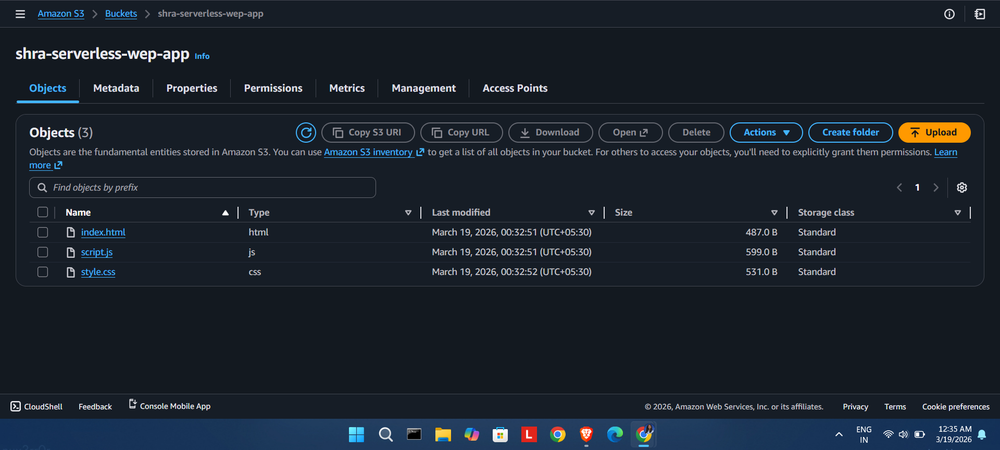

---

### Step 2 — Create CloudFront Distribution

- Create a new distribution named `distribution-shra-serverless-web-app`
- Set origin to the S3 bucket created above
- Enable **Origin Access Control (OAC)**

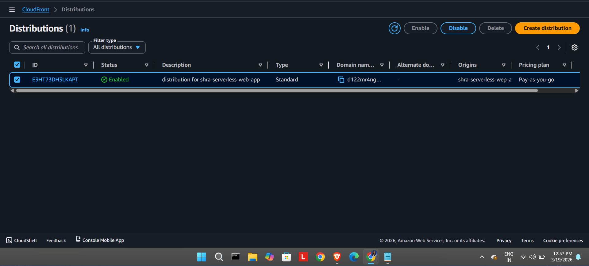

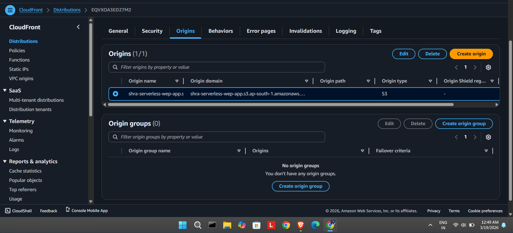

---

### Step 3 — Configure S3 Bucket Policy

- Go to CloudFront → Origins → copy the OAC bucket policy
- Go to S3 → Permissions → Bucket Policy → paste the policy
- This allows only CloudFront to access the S3 bucket

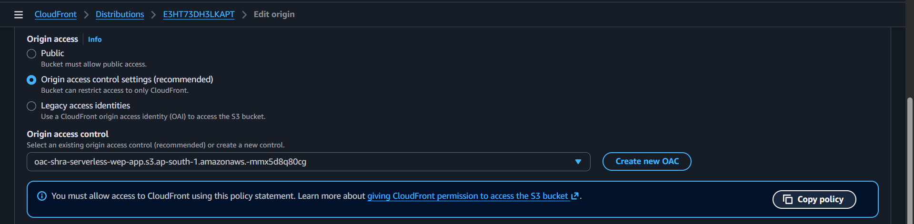

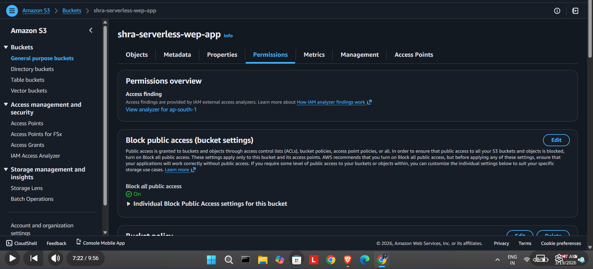

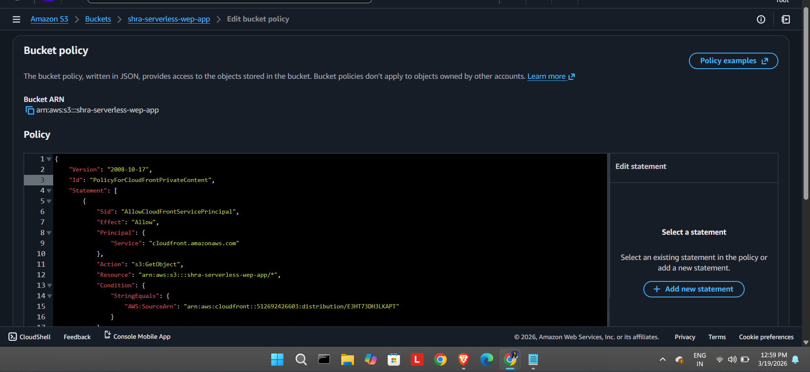

---

### Step 4 — Set Default Root Object

- In CloudFront distribution → Settings → Edit
- Set **Default Root Object** to `index.html`

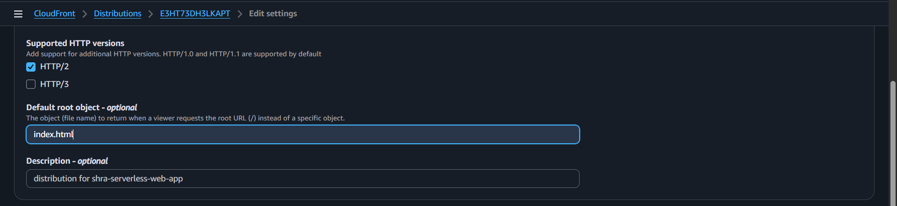

---

### Step 5 — Register Free Domain & Configure Route 53

- Registered free domain `shra.qzz.io` from [DigitalPlat](https://domain.digitalplat.org) (no student email required)
- In Route 53 → Create a **Public Hosted Zone** for `shra.qzz.io`
- Copy the 4 NS records from Route 53
- Paste NS records into DigitalPlat nameserver settings

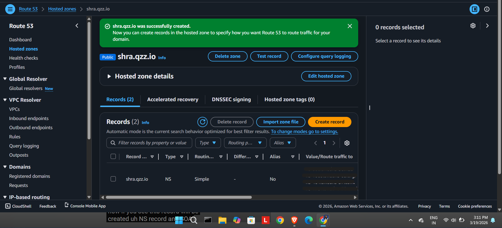

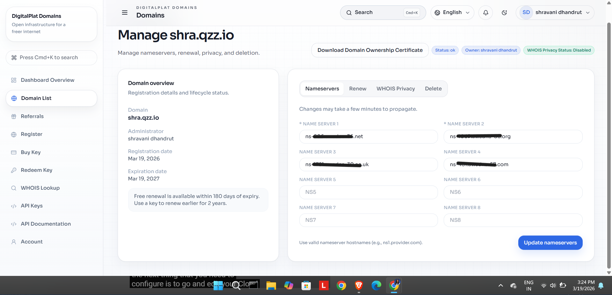

---

### Step 6 — Set CloudFront Alternate Domain Name

- Go to CloudFront → General tab → Edit
- Under **Alternate Domain Names (CNAMEs)** add `shra.qzz.io`

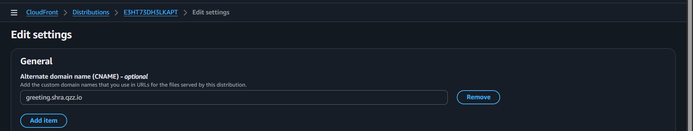

---

### Step 7 — Create SSL Certificate (ACM)

> ⚠️ Switch region to **us-east-1 (N. Virginia)** — required for CloudFront!

- Go to AWS Certificate Manager → Request public certificate
- Enter domain: `shra.qzz.io`
- Choose **DNS validation** → Click "Create records in Route 53"
- Wait for status to change to **Issued**

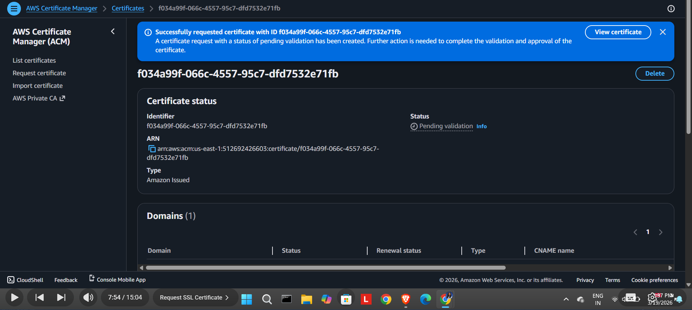

---

### Step 8 — Create Route 53 DNS Validation Record

- From ACM certificate settings → Click "Create records in Route 53"
- Verify the CNAME record appears in the hosted zone

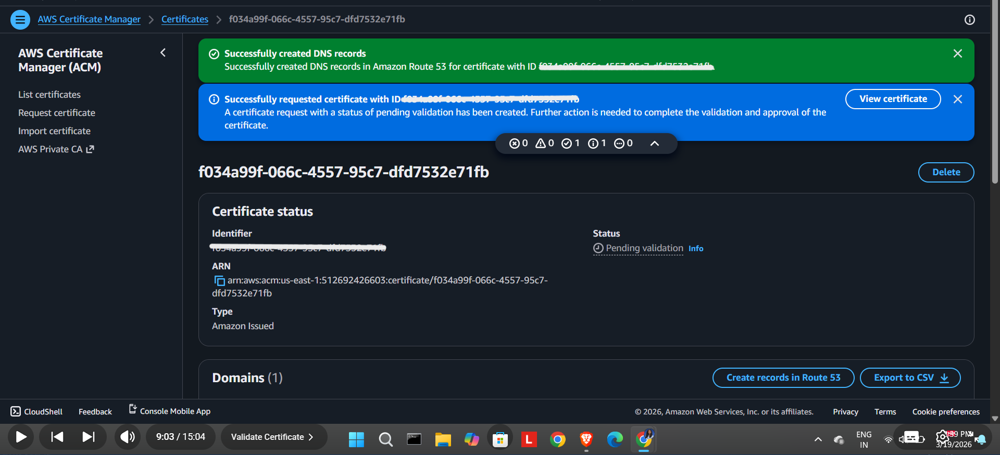

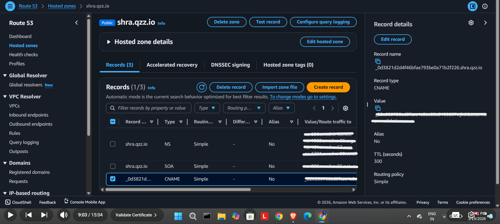

---

### Step 9 — Attach SSL Certificate to CloudFront

- Go back to CloudFront → General tab → Edit
- Under **Custom SSL Certificate** select the issued ACM certificate
- Save and wait for deployment

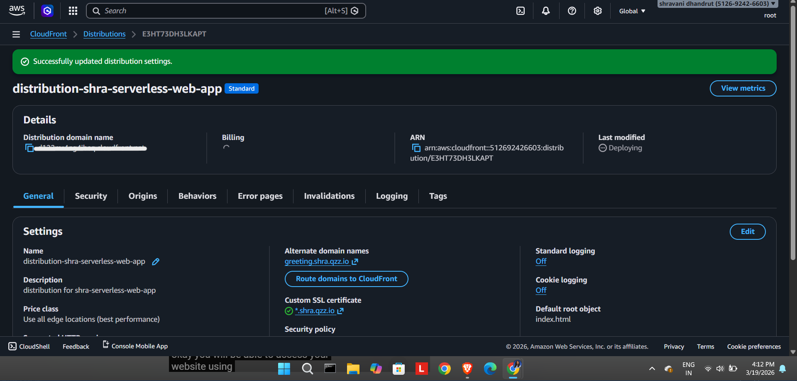

---

### Step 10 — Create Route 53 A Record for CloudFront

- In Route 53 hosted zone → Create record
- Record name: `greeting`
- Type: **A (Alias)**
- Route traffic to: **CloudFront distribution**
- Save and verify

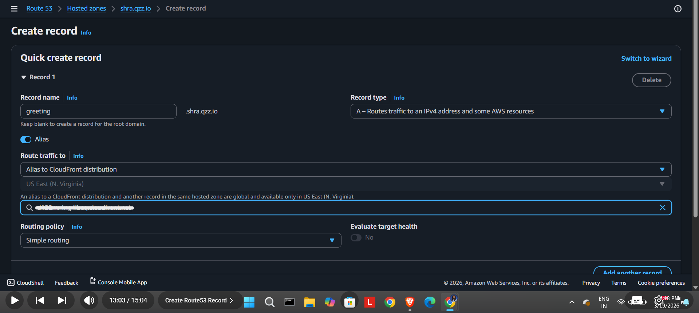

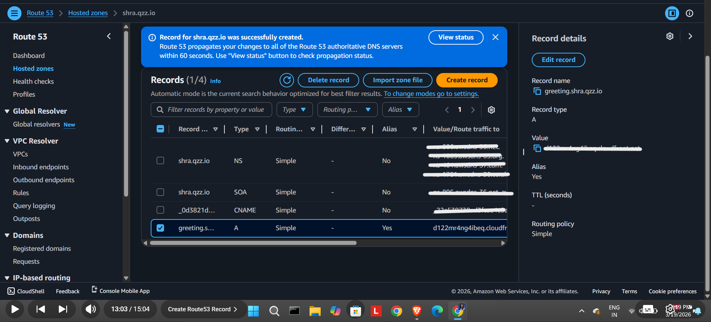

---

### Step 11 — Verify Domain Works

- Visit `https://shra.qzz.io` in browser
- Website loads over HTTPS with custom domain ✅

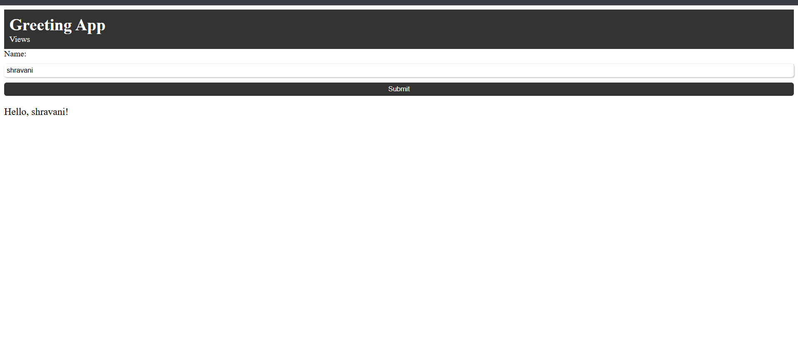

---

### Step 12 — Create DynamoDB Table

- Navigate to DynamoDB in `ap-south-1`
- Table name: `db-shra-serverless-wep-app`
- Partition key: `id` (String)
- Billing mode: On-demand (free tier)

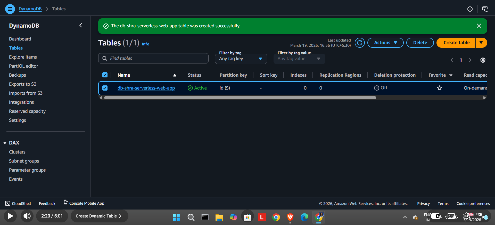

---

### Step 13 — Create Initial Item in DynamoDB

- Go to Explore Table Items → Create item
- Add initial item:
```json
{
  "id": "0",
  "views": 0
}
```

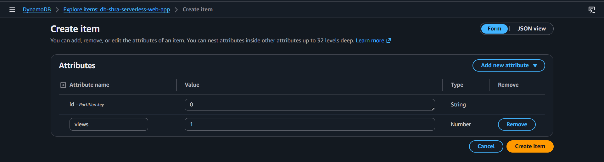

---

### Step 14 — Create IAM Role for Lambda

- Go to IAM → Roles → Create Role
- Use case: **Lambda**
- Attach policies:
  - `AmazonDynamoDBFullAccess`
  - `AWSLambdaBasicExecutionRole`
- Role name: `role-shra-serverless-wep-app`


---

### Step 15 — Create Lambda Function

- Navigate to Lambda in `ap-south-1`
- Function name: `fun-shra-serverless-wep-app`
- Runtime: **Python 3.x**
- Execution role: select `role-shra-serverless-wep-app`
- Paste the visitor counter code (see below)
- Click **Deploy**
- Enable **Function URL** with Auth type: `NONE` and CORS: Enabled


---

## 🐍 Lambda Function Code

```python
import json
import boto3

dynamodb = boto3.resource('dynamodb')
table = dynamodb.Table('db-shra-serverless-wep-app')

def lambda_handler(event, context):
    response = table.get_item(Key={
        'id': '0'
    })
    views = response['Item']['views']
    views = views + 1
    print(views)

    response = table.put_item(Item={
        'id': '0',
        'views': views
    })

    return {
        'statusCode': 200,
        'headers': {
            'Content-Type': 'application/json',
            'Access-Control-Allow-Origin': '*'
        },
        'body': json.dumps(views)
    }
```

**How it works:**
1. `get_item` — reads current visitor count from DynamoDB (`id = '0'`)
2. Increments count by 1
3. `put_item` — writes updated count back to DynamoDB
4. Returns count as JSON response with CORS headers

---

## 🐛 Challenges & Solutions

| Challenge | Solution |
|---|---|
| No `.edu` student email for GitHub Student Pack | Used **DigitalPlat** for a free domain with zero verification required |
| Route 53 is not free ($0.50/month) | Accepted minimal cost for the project duration; terminated after completion |
| Lambda Function URL showing DNS error in browser | Changed Chrome's DNS to Google DNS (`8.8.8.8`) within browser security settings only |
| `ResourceNotFoundException` when calling DynamoDB | Fixed by verifying exact table name, ensuring same region (`ap-south-1`), and confirming initial item existed |
| Visitor count incrementing by 2 instead of 1 | Browser sends two requests (page + favicon). Resolves naturally when called via JavaScript `fetch()` |
| `put_item` writing to wrong item (`id='1'` instead of `id='0'`) | Fixed typo in the code — changed `put_item` id from `'1'` to `'0'` |

---

## 💰 Cost Breakdown

| Service | Cost |
|---|---|
| Amazon S3 | $0.00 (Free Tier) |
| Amazon CloudFront | $0.00 (Free Tier) |
| AWS Lambda | $0.00 (Free Tier) |
| Amazon DynamoDB | $0.00 (Free Tier) |
| AWS ACM SSL Certificate | $0.00 (Always Free) |
| AWS IAM | $0.00 (Always Free) |
| DigitalPlat Domain | $0.00 (Free) |
| **Amazon Route 53** | **~$0.50** (one hosted zone, one month) |
| **Total** | **~$0.50** |

---

## 🗑️ Resource Cleanup

All resources were terminated after project completion. Deletion order to avoid dependency errors:

```
1. Lambda Function
2. CloudFront Distribution  (disable first → wait → delete)
3. ACM Certificate          (switch to us-east-1 first)
4. Route 53 Hosted Zone     (delete records first → delete zone)
5. S3 Bucket                (empty first → delete)
6. DynamoDB Table
7. IAM Role                 (always delete last)
```

---

## 📚 Key Learnings

- How to host a static website on **S3 + CloudFront** with Origin Access Control
- Configuring **custom domains** using Route 53 and free third-party providers
- Issuing and attaching **SSL certificates** via AWS Certificate Manager
- Writing **serverless backend functions** with AWS Lambda using Python (boto3)
- Storing and retrieving data from **DynamoDB** via Lambda
- Configuring **IAM roles** with least-privilege permissions
- Debugging real-world AWS issues including region mismatches, DNS errors, and CORS

---
**Shravani Dhandrut**
☁️ AWS Cloud Enthusiast
🔗 [LinkedIn](https://www.linkedin.com/in/shravanidhandrut/)
```
> ⭐ If you found this project helpful, please give it a star!
